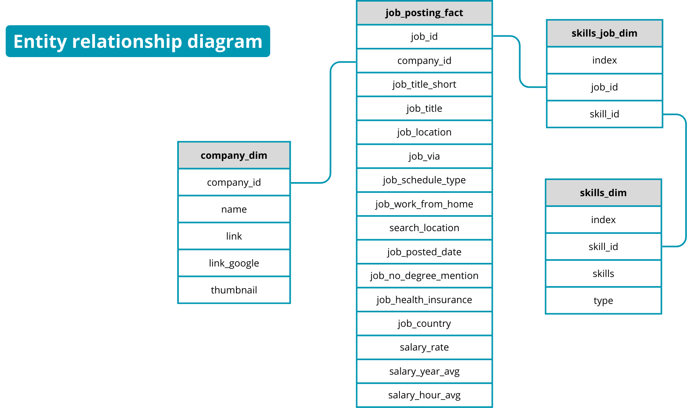
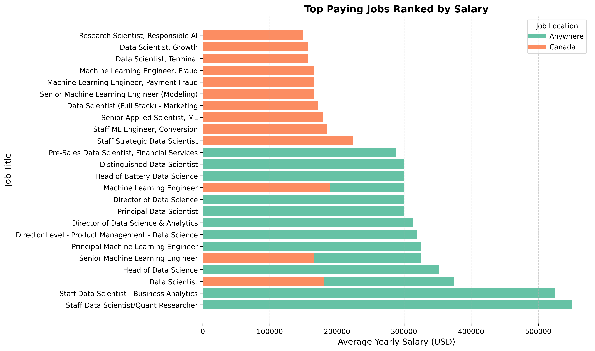

# SQL Project: Analysis of Data Jobs in 2023 📊

## Overview
This project analyzes job postings for **Machine Learning Engineers** and **Data Scientists** in 2023. The goal is to uncover trends in job locations, salaries, required skills, and remote work opportunities (due to I am really interested on both of them and not sure about thw skills I will need to focus on). The analysis is conducted using SQL queries on a dataset of job postings, companies, and skills.

This project is part of my portfolio for **Machine Learning and Data Science** roles, showcasing my ability to extract meaningful insights from data using SQL. The original dataset was presented ans shared by Luke Barousse on Youtube [(Here his channel)](https://www.youtube.com/@LukeBarousse). I am gratefull for his teaching.

---

## Dataset Description
The dataset consists of four main tables:
1. **job_postings_fact**: Contains details about job postings, including job titles, locations, salaries, and posting dates.
2. **company_dim**: Provides information about companies posting the jobs.
3. **skills_dim** and
4. **skills_job_dim**: Contain data about skills required for each job.


---

## Queries and Insights

### Query 1: Top Paying Jobs in Canada and Remote Roles
```sql
(
    SELECT job_id,
        job_title,
        job_location,
        job_schedule_type,
        salary_year_avg,
        job_posted_date,
        name AS company_name
    FROM job_postings_fact
        LEFT JOIN company_dim ON job_postings_fact.company_id = company_dim.company_id
    WHERE job_title_short IN ('Machine Learning Engineer', 'Data Scientist')
        AND job_location = 'Canada'
        AND salary_year_avg IS NOT NULL
    ORDER BY salary_year_avg DESC
    LIMIT 15
)
UNION ALL
(
    SELECT job_id,
        job_title,
        job_location,
        job_schedule_type,
        salary_year_avg,
        job_posted_date,
        name AS company_name
    FROM job_postings_fact
        LEFT JOIN company_dim ON job_postings_fact.company_id = company_dim.company_id
    WHERE job_title_short IN ('Machine Learning Engineer', 'Data Scientist')
        AND job_location = 'Anywhere'
        AND salary_year_avg IS NOT NULL
    ORDER BY salary_year_avg DESC
    LIMIT 15
);
```

#### Results:
| job_id   | job_title                                      | job_location | job_schedule_type | salary_year_avg | job_posted_date       | company_name       |
|----------|------------------------------------------------|--------------|-------------------|-----------------|-----------------------|--------------------|
| 1499100  | Staff Strategic Data Scientist                 | Canada       | Full-time         | 224000.0        | 2023-03-11 01:27:48   | Course Hero        |
| 743109   | Machine Learning Engineer                     | Canada       | Full-time         | 190000.0        | 2023-11-11 02:31:07   | Autodesk           |
| 313325   | Staff ML Engineer, Conversion                 | Canada       | Full-time         | 185500.0        | 2023-05-31 14:15:08   | Stripe             |
| 746652   | Data Scientist                                | Canada       | Full-time         | 180000.0        | 2023-04-12 09:31:20   | Wish               |
| 476318   | Senior Applied Scientist, ML                  | Canada       | Full-time         | 179000.0        | 2023-12-12 18:28:46   | Thomson Reuters    |
| ...      | ...                                            | ...          | ...               | ...             | ...                   | ...                |
| 40145    | Staff Data Scientist/Quant Researcher         | Anywhere     | Full-time         | 550000.0        | 2023-08-16 16:05:16   | Selby Jennings     |
| 1714768  | Staff Data Scientist - Business Analytics     | Anywhere     | Full-time         | 525000.0        | 2023-09-01 19:24:02   | Selby Jennings     |
| 1131472  | Data Scientist                                | Anywhere     | Full-time         | 375000.0        | 2023-07-31 14:05:21   | Algo Capital Group |
| ...      | ...                                            | ...          | ...               | ...             | ...                   | ...                |


#### Insights:
- **Top Salaries in Canada**: The highest-paying role in Canada is **Staff Strategic Data Scientist** at **Course Hero**, offering a salary of **$224,000**. Other high-paying roles include **Machine Learning Engineer** at **Autodesk** ($190,000) and **Data Scientist** at **Wish** ($180,000).
- **Remote Roles**: Remote roles offer significantly higher salaries, with the top-paying role being **Staff Data Scientist/Quant Researcher** at **Selby Jennings**, offering **$550,000**. Other high-paying remote roles include **Staff Data Scientist - Business Analytics** ($525,000) and **Data Scientist** at **Algo Capital Group** ($375,000).
- **Company Trends**: Companies like **Stripe**, **Block**, and **Selby Jennings** frequently appear in the top-paying roles, indicating they are leading employers in the data science and machine learning fields.

---

### Query 2: Top Paying Remote Jobs and Their Required Skills
```sql
WITH top_paying_jobs AS (
    SELECT	
        job_id,
        job_title,
        salary_year_avg,
        name AS company_name
    FROM
        job_postings_fact
    LEFT JOIN company_dim ON job_postings_fact.company_id = company_dim.company_id
    WHERE
        job_title_short IN ('Machine Learning Engineer', 'Data Scientist') AND 
        job_location = 'Anywhere' AND 
        salary_year_avg IS NOT NULL
    ORDER BY
        salary_year_avg DESC
    LIMIT 10
)

SELECT 
    top_paying_jobs.*,
    skills
FROM top_paying_jobs
INNER JOIN skills_job_dim ON top_paying_jobs.job_id = skills_job_dim.job_id
INNER JOIN skills_dim ON skills_job_dim.skill_id = skills_dim.skill_id
ORDER BY
    salary_year_avg DESC;
```

#### Results:
| job_id   | job_title                                      | salary_year_avg | company_name       | skills      |
|----------|------------------------------------------------|-----------------|--------------------|-------------|
| 1499100  | Staff Strategic Data Scientist                 | 224000.0        | Course Hero        | sql         |
| 1499100  | Staff Strategic Data Scientist                 | 224000.0        | Course Hero        | python      |
| 1499100  | Staff Strategic Data Scientist                 | 224000.0        | Course Hero        | r           |
| 1499100  | Staff Strategic Data Scientist                 | 224000.0        | Course Hero        | aws         |
| 1499100  | Staff Strategic Data Scientist                 | 224000.0        | Course Hero        | bigquery    |
| ...      | ...                                            | ...             | ...                | ...         |

#### Insights:
- **Top Skills for High-Paying Roles**: The most common skills required for high-paying remote roles include **SQL**, **Python**, **R**, **AWS**, and **BigQuery**. These skills are essential for data manipulation, analysis, and cloud computing.
- **Skill Diversity**: High-paying roles often require a combination of technical skills (e.g., **Python**, **AWS**) and data visualization tools (e.g., **Tableau**).
- **Company-Specific Trends**: Companies like **Course Hero** and **Autodesk** emphasize skills like **SQL**, **Python**, and **AWS**, while **Block** focuses on **Go**, **Databricks**, and **TensorFlow**.

---

### Query 3: Top Skills in Demand for Remote Roles
```sql
SELECT 
    skills,
    COUNT(skills_job_dim.job_id) AS demand_count
FROM job_postings_fact
INNER JOIN skills_job_dim ON job_postings_fact.job_id = skills_job_dim.job_id
INNER JOIN skills_dim ON skills_job_dim.skill_id = skills_dim.skill_id
WHERE
    job_title_short IN ('Machine Learning Engineer', 'Data Scientist')
    AND job_work_from_home = True 
GROUP BY
    skills
ORDER BY
    demand_count DESC
LIMIT 5;
```

#### Results:
| skills   | demand_count |
|----------|--------------|
| python   | 11620        |
| sql      | 7886         |
| r        | 4814         |
| aws      | 3141         |
| tableau  | 2505         |

#### Insights:
- **Most In-Demand Skills**: **Python** is the most in-demand skill for remote roles, with **11,620** job postings requiring it. **SQL** follows closely with **7,886** postings, highlighting the importance of data querying and manipulation.
- **Emerging Trends**: Skills like **R**, **AWS**, and **Tableau** are also highly sought after, indicating a growing need for statistical analysis, cloud computing, and data visualization in remote roles.

---

### Query 4: Skills with High Demand and Salary for Machine Learning Engineers
```sql
SELECT 
    skills_dim.skill_id,
    skills_dim.skills,
    'Machine Learning Engineer' AS job_title_short,
    COUNT(skills_job_dim.job_id) AS demand_count,
    ROUND(AVG(job_postings_fact.salary_year_avg), 0) AS avg_salary
FROM job_postings_fact
INNER JOIN skills_job_dim ON job_postings_fact.job_id = skills_job_dim.job_id
INNER JOIN skills_dim ON skills_job_dim.skill_id = skills_dim.skill_id
WHERE
    job_title_short = 'Machine Learning Engineer'
    AND salary_year_avg IS NOT NULL
    AND job_work_from_home = True 
GROUP BY
    skills_dim.skill_id,
    skills_dim.skills
HAVING
    COUNT(skills_job_dim.job_id) > 10
ORDER BY
    job_title_short,
    demand_count DESC,
    avg_salary DESC
LIMIT 15;
```

#### Results:
| skill_id | skills   | job_title_short           | demand_count | avg_salary |
|----------|----------|---------------------------|--------------|------------|
| 1        | python   | Machine Learning Engineer | 33           | 150570     |
| 76       | aws      | Machine Learning Engineer | 12           | 168402     |
| 0        | sql      | Machine Learning Engineer | 11           | 152983     |
| 101      | pytorch  | Machine Learning Engineer | 11           | 122893     |

#### Insights:
- **High-Demand Skills**: **Python** is the most in-demand skill for **Machine Learning Engineers**, with **33** job postings and an average salary of **$150,570**.
- **High-Paying Skills**: Skills like **AWS** and **SQL** command higher average salaries (**$168,402** and **$152,983**, respectively), indicating their value in the job market.
- **Specialized Skills**: **PyTorch** is also in demand, with **11** postings and an average salary of **$122,893**, reflecting the importance of deep learning frameworks in machine learning roles.

---

## Key Takeaways
- **Salary Trends**: Remote roles offer significantly higher salaries compared to location-specific roles, with some positions paying over **$500,000**.
- **Skills in Demand**: **Python**, **SQL**, and **AWS** are the most critical skills for data science and machine learning roles.
- **Remote Work Opportunities**: Remote roles are highly prevalent, with a strong emphasis on technical and analytical skills.

---

## How to Use This Project
1. Clone the repository.
2. Set up your SQL environment and load the dataset.
3. Run the queries to reproduce the analysis.
4. Explore the insights and adapt the queries for further analysis.

---

## Tools and Technologies
- **SQL**: For querying and analyzing the dataset.
- **GitHub**: For version control and showcasing the project.
- **VS Code**: For running the queries

---

### **Next Steps for me:** 📌✅🚀
- Consider applying for "Anywhere" jobs if my goal is to maximize salary.
- Investigate company-specific salary trends for deeper insights.
- Explore how job schedules (e.g., full-time vs. contract) impact pay.
